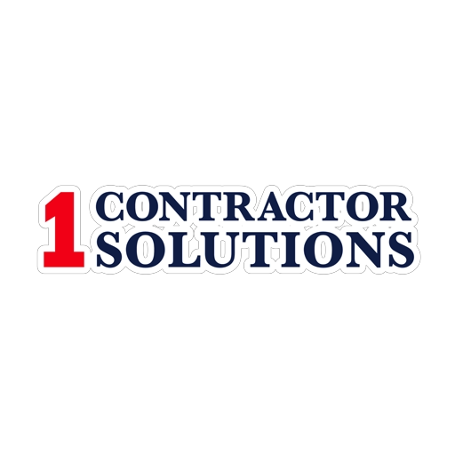

# 1 Construction Solutions

<p align="center">
  
</p>

<p align="center">
  <a href="#"></a>
  <a href="#"></a>
  <a href="#"></a>
  <a href="#"></a>
</p>

## 🏗️ Construction Project Management System

A powerful web application built with Laravel that helps construction companies manage their projects, permits, documents, and client communications in one unified platform.

<p align="center">
  
</p>

## ✨ Key Features

- **Dual Interface System** - Separate admin and client portals
- **Permit Management** - Apply, review, and approve construction permits
- **Project Tracking** - Monitor construction projects from start to finish
- **Document Management** - Store and organize project documents
- **Real-time Communication** - Messaging system between clients and administrators
- **Invoicing** - Create and manage project invoices
- **Verification System** - Approve contractor credentials and documentation

## 🚀 Quick Start

```bash
# Clone the repository
git clone https://github.com/yourusername/1-construction.git

# Navigate to the project folder
cd 1-construction

# Install dependencies
composer install
npm install

# Configure environment
cp .env.example .env
php artisan key:generate

# Run migrations and seed the database
php artisan migrate --seed

# Compile assets
npm run dev

# Create storage link
php artisan storage:link

# Start the server
php artisan serve
```

Then visit `http://localhost:8000` in your browser.

## 🔧 Technology Stack

- **Backend**: Laravel 10.x
- **Frontend**: 
  - Blade Templates
  - Tailwind CSS
  - Alpine.js
- **Database**: MySQL
- **Authentication**: Laravel Sanctum
- **File Storage**: Laravel Storage

## 📸 Screenshots

<table>
  <tr>
    <td></td>
    <td></td>
  </tr>
  <tr>
    <td align="center"><b>Admin Panel</b></td>
    <td align="center"><b>Client Dashboard</b></td>
  </tr>
  <tr>
    <td></td>
    <td></td>
  </tr>
  <tr>
    <td align="center"><b>Permit Management</b></td>
    <td align="center"><b>Document Management</b></td>
  </tr>
</table>

## 👥 Target Users

- **Construction Companies** - Manage multiple projects and permits
- **Contractors** - Submit projects and apply for permits
- **Project Managers** - Track progress and manage documentation
- **Administrators** - Approve permits and maintain system

## 🛣️ Roadmap

- [ ] Mobile application for on-site permit verification
- [ ] Integration with mapping services for project locations
- [ ] Calendar view for project timelines and deadlines
- [ ] Advanced reporting and analytics dashboard
- [ ] Electronic signature for legal documentation

## 🤝 Contributing

Contributions, issues, and feature requests are welcome! Feel free to check the [issues page](https://github.com/yourusername/1-construction/issues).

## 📄 License

This project is [MIT](LICENSE) licensed.

## 📞 Contact

For support or inquiries: info@1construction.com 